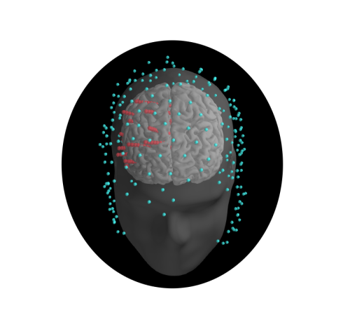

# SEEG - HDEEG Coregistration Demo



## Introduction

Complexity, defined as the coexistence of functional differentiation and functional integration is a general property of thalamo-cortical circuits that can be characterized at multiscale level. T3.2.2 mainly focused on the relationship between slow waves and complexity, explored by perturbations and electrophysiological recordings, from micro- to macro-scale. The final goal was to link dynamics occurring at the micro-scale, such as sleep-like neuronal bistability, to the collapse/emergence of global patterns of complex interactions among brain areas at the macroscale.    

At the mesoscale level, in Pigorini et al (*in preparation*) we combined for the first time intracortical single pulse electrical stimulation (SPES) in humans undergoing pre-surgical evaluation, with simultaneous intracortical recordings (stereo-EEG) and high-density electroencephalography (hd-EEG, 256 channels) during both wakefulness and sleep. Local perturbations with SPES allow studying bistable dynamics (downstates in the Local Field Potential) and their effects on local cortico-cortical interactions (Pigorini et al. NeuroImage 2015). Adding simultaneous hd-EEG links these intracortical events to overall connectivity and complexity as assessed at the scalp level (Casali et al. Sci Tr Med 2014). 

Here you can find a representative dataset from one subject. The full dataset will be on line within the end of 2020.


## Running the demonstration

In order to run the scripts there are two options:

### 1. Binder

You can use [this link](https://mybinder.org/v2/gh/iTCf/unimi_demo_dataset/master) which will take you to the [MyBinder]() site, where an online Python environment will be created for you with all the required libraries and you will enter an interactive session.

Note: building the environment may take some time, as it has to get and install all the required libraries.

### 2. Locally

You can clone the repository and run the script in your own computer.  You will need a Python environment with the libraries that appear in the environment.yml file.

It is advisable to use [Anaconda](https://www.anaconda.com/distribution/). Please refer to the [user guide](https://docs.conda.io/projects/conda/en/latest/user-guide/tasks/manage-environments.html) in order to learn how to set up the environment. The easiest way to create it would be to install anaconda, open a terminal, navigate to the repository folder and run:

```bash
conda env create -f environment.yml

```

## Dataset description

### HDEEG

Manufacturer: EGI 

Number of channels: 256 

Acquisition sampling rate: 1000 Hz

### SEEG

Manufacturer: Nihon Kohden

Number of channels: 183

Acquisition sampling rate: 1000 Hz

__Note__: Data for both EEG and SEEG has been downsampled to 200 Hz after trigger detection for improved performance.


## Contents

This demo dataset comprises the following steps:

* Loading data
* Visualizing raw data
* Visualizing scalp and intracranial electrode positions
* Visualizing coregistration
* Extracting epochs
* Visualizing epochs
* Computing evoked responses
* Visualizing evoked reponses
